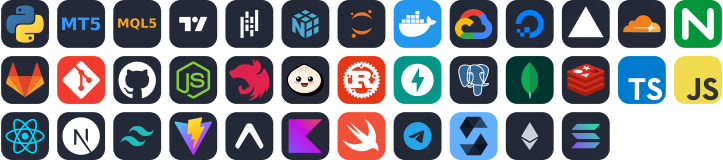

# Hi 👋 I'm Greatonic

## Quant & Algorithmic Systems • Frontend Engineer

**🎓 B.Sc. Computer Science with Economics**

I build software across web, mobile and backend systems, including products for financial technology, algorithmic trading, automation and blockchain.

- 🖥️ Portfolio: [greatonical.vercel.app](https://greatonical.vercel.app)
- ✉️ Email: [gabrielawosusi@outlook.com](mailto:gabrielawosusi@outlook.com)

### What I build

- 🌐 Modern frontend applications and interactive products
- 📱 Mobile applications
- ⚙️ Backend APIs, services and real-time systems
- 📈 Quantitative & algorithmic trading systems
- 🧪 Strategy research, backtesting and walk-forward testing
- 📊 MetaTrader 5 Expert Advisors and TradingView indicators
- 🔌 Broker integrations and trade execution pipelines
- 🤖 Automation, bots and Telegram Mini Apps
- 🧠 AI agents and LLM-powered tools
- ⛓️ Blockchain and fintech infrastructure
- 🚀 Deployment, CI/CD and cloud infrastructure

### 🛠️ Tech Stack

  

### Socials

  <a href="https://github.com/greatonical" target="_blank" rel="noreferrer"><picture><source media="(prefers-color-scheme: dark)" srcset="https://raw.githubusercontent.com/danielcranney/readme-generator/main/public/icons/socials/github-dark.svg" /></picture></a>
  <a href="https://www.linkedin.com/in/greatonical" target="_blank" rel="noreferrer"><picture><source media="(prefers-color-scheme: dark)" srcset="https://raw.githubusercontent.com/danielcranney/readme-generator/main/public/icons/socials/linkedin-dark.svg" /></picture></a>
  <a href="https://x.com/greatonical" target="_blank" rel="noreferrer"><picture><source media="(prefers-color-scheme: dark)" srcset="https://raw.githubusercontent.com/danielcranney/readme-generator/main/public/icons/socials/twitter-dark.svg" /></picture></a>

### Badges

  
  

**My GitHub Stats**

  

  <picture>
    <source media="(prefers-color-scheme: dark)" srcset="https://streak-stats.demolab.com/?user=greatonical&theme=dark&background=0D1117&hide_border=true" />
    
  </picture>

  

